<!---
your comment goes here
and here
-->


# Introduction
## Description
Pickpeak is a R software package that makes use of the shiny package developped by Rstudio. While some of its functions might be used outside the shiny application, pickpeak is not intended to be used in other ways than through the graphical interface.

The main tools for the analysis of capillary electrophoresis results are GeneMapper and PeakScanner, developped by Life Technologies. Pickpeak is a free open source graphical tool, which, even if not as complete as pre-existing tools cotains some of their most common features.

## Disclaimer
Permission is hereby granted, free of charge, to any person obtaining a copy of this software and associated documentation files (the "Software"), to deal in the Software without restriction, including without limitation the rights to use, copy, modify, merge, publish, distribute, sublicense, and/or sell copies of the Software, and to permit persons to whom the Software is furnished to do so, subject to the following condition:

THE SOFTWARE IS PROVIDED "AS IS", WITHOUT WARRANTY OF ANY KIND, EXPRESS OR IMPLIED, INCLUDING BUT NOT LIMITED TO THE WARRANTIES OF MERCHANTABILITY, FITNESS FOR A PARTICULAR PURPOSE AND NONINFRINGEMENT. IN NO EVENT SHALL THE AUTHORS OR COPYRIGHT HOLDERS BE LIABLE FOR ANY CLAIM, DAMAGES OR OTHER LIABILITY, WHETHER IN AN ACTION OF CONTRACT, TORT OR OTHERWISE, ARISING FROM, OUT OF OR IN CONNECTION WITH THE SOFTWARE OR THE USE OR OTHER DEALINGS IN THE SOFTWARE.

## Capillary electrophoresis 
Capillary electrophoresis  is an alternative to conventional slab gel electrophoresis for the separation of DNA fragments. It offers a number of advantages over slab gel separations in terms of speed, resolution, sensitivity, and data handling. Separation times are generally only a few minutes and the DNA is detected either by UV absorption or by fluorescent labeling. The quantity of DNA required for separation is in the nanogram range. Single‐base resolution can be obtained on fragments up to several hundred base pairs. In the presence of appropriate standards, fragments can be accurately sized based on relative electrophoretic mobility. A protocol for the analysis of synthetic oligonucleotides in a flowable matrix is described in this unit [@Smith2003].

## Short presentation of the tool
Starting from capillary electrophoresis result files (FSA files), pickpeak can display, scale, discover and annotate the peaks (Figures \@ref(fig:intro1) and \@ref(fig:intro2)).

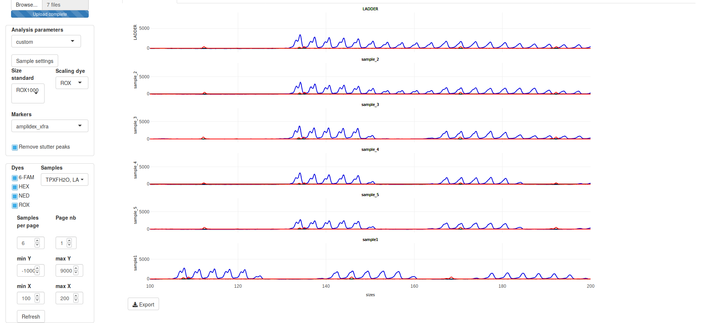{width=500px}

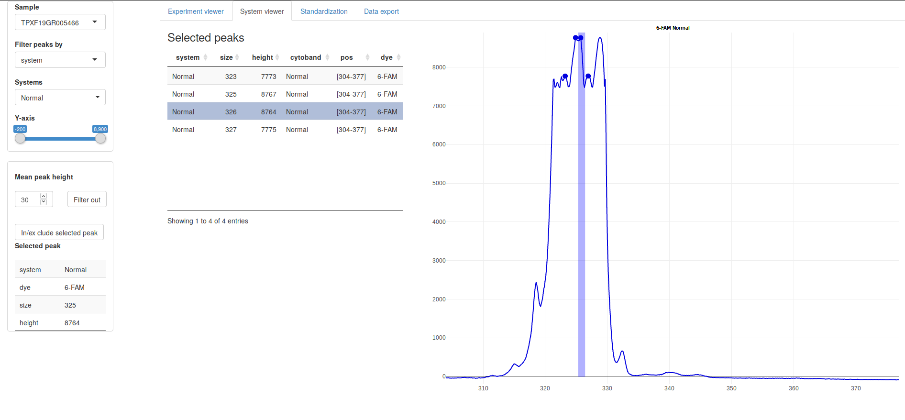{width=500px}


# Before running pickpeak

## Configuration files
Examples of the configuration files are available in the package.

```
system.file( "configuration_files", package = "pickpeak")
```

### Main configuration file
This file is called as a parameter when starting pickpeak from an interactive R session. Its role is to describe the paths to the other configuration files or directories. It is json formatted.
```
{
	"predefined_parameters":"/path/to/predefined_configuration_file",
	"datadir":"/path/to/external_data_dir"
}
```
The demo file is available here:
```
system.file( "configuration_files",'pp_localConfigShiny.json', package = 'pickpeak')
```
### Predefined configuration file (predefined_parameters)
pickpeak allows users to define the configuration criteria. According to the experiment type, the set of analysis criteria can be different.
The file is tab-delimited and must be formatted according to heareafter. This file can also be edited via the user interface (see below).

id |	standard.dye|	Dye1|	Dye2|Dye3|	Dye4|	Dye5	|analysis_type	|ladder|
---|---------------|-------|-------|----|------|-----------|---------------|------|
paternity|	LIZ|	900|	900|	900|	900|	500|	paternity_v17|	ILS500|
xfra|	    ROX	|5000|	100|	100	|100|	100|	amplidex_xfra|	ROX1000|
HNPCC|	    ROX |	900|900	|900	|300|	500	|None|	LIZ500|
```
system.file( "configuration_files",'config','predef.tab', package = 'pickpeak')
```
### External data directory
The data directory contains two directories which in turn contains files
```
|-data
  |-dyes
    |-colors.json
    |-scales.json
  |-markers
    |-markers.tab
    |-markers_kit1.tab
    |-markers_kit2.tab
    |-markers_kit1_bins.txt
    |- ...
```
#### The dyes folder
##### colors.json
This file defines the colors selected for each dye that will be encountered in the data analysis.
```
{
  "6-FAM": {
    "color": "#0101DF",
    "cval": "blue"
  },
  "VIC": {
    "color": "#31B404",
    "cval": "green"
  },  
  "NED": {
    "color": "#000000",
    "cval": "yellow"
  },  
  "PET": {
    "color": "#FF0000",
    "cval": "red"
  },  
  "LIZ": {
    "color": "#FFBF00",
    "cval": "orange"
  },
  "ROX": {
    "color": "#FF0000",
    "cval": "red"
  }, 
  "HEX": {
    "color": "#00FF00",
    "cval": "green"
  }
}
```
system.file( "configuration_files",'dyes','colors.json', package = 'pickpeak')
```
```
##### scales.json
This file defines the position of the scaling peaks that will be used to convert the migration time into fragment lengths.
```
{
  "LIZ500": 
    [35, 50, 75, 100, 139, 150, 160, 200, 250, 300, 340, 350, 400, 450, 490, 500],
  "ILS500":
    [60, 65, 80, 100, 120, 140, 160, 180, 200, 225, 250, 275, 300, 325, 
    350, 375, 400, 425, 450, 475, 500],
  "LIZ120":
    [15, 20, 25, 35, 50, 62, 80, 110, 120],
  "LIZ600":
    [20, 40, 60, 80, 100, 114, 120, 140, 160, 180, 200, 214, 220, 240, 250, 260, 280, 300, 314, 320, 
    340, 360, 380, 400, 414, 420, 440, 460, 480, 500, 514, 520, 540, 560, 580 ,600],
  "ROX1000":
    [79,90,105,131,151,182,201,254,306,337,362,425,486,509,560,598,674,739,799,902,1007],
  "CFEU2":
    [100, 114, 120, 140, 160, 180, 200, 214, 220, 240, 250, 260, 280, 
    300, 314, 320, 340, 360, 380, 400, 414, 420, 440, 460, 480, 500, 514, 520, 540, 560, 580]
}
```
```
system.file( "configuration_files",'dyes','scales.json', package = 'pickpeak')
```

#### The data folder
The files that we are going to describe hereafter are not mandatary for pickpeak to run (only visualisation of the sample raw data). However, they allow a precise analysis and annotation of the peaks.
```
system.file( "configuration_files",'data',package = 'pickpeak')
```
##### markers.tab
The markers folder contains a markers.tab file that describes the other files within the directory.

analysis|	marker.file|	bin.file|	runName|
--------|--------------|------------|----------|
aneuploidies|	markers_qstr_elucigene.tab|	NA|	Aneu|
paternity_v16|	markers_PowerPlex_ESX_16_v3.0.tab|	PowerPlex_ESX_Bins_IDX_v3.0_16.txt|	Pat|
paternity_v17|	markers_PowerPlex_ESX_17_v3.0.tab|	PowerPlex_ESX_Bins_IDX_v3.0_17.txt|	Pat|
amplidex_xfra|	markers_Amplidex_FMR1.tab|	NA	|Xfra|
elucigene_muco|	markers_Elucigene_MUCO50.tab|	NA|	Muco|

The first column (analysis) contains the name of an analysis type. For a given analysis type there is an associated file containing a list of markers / systems (see hereafter) and potentially a file containing a list of bins (hereafter). If there is no bin defined for an analysis, NA is used instead of a file name. A short name (runName) can be specified for a given type of analysis.
```
system.file( "configuration_files",'data','markers.tab',package = 'pickpeak')
```
##### marker file (tab delimited)
This file contains for each dye, the position of the systems (regions targetted) together with their molecular size.

system | cytoband | start.pos | end.pos | color | dye|
------ | -------- | --------- | ------- | ----- | ---|
system1 | Xp22.22 | 68 | 112 | blue | 6-FAM|
system2 | 3p20.15 | 96.01 | 145.25 | blue | 6-FAM|
DXS3337 | 2q35 | 172.01 | 255 | green | VIC|
...
```
system.file( "configuration_files",'data','markers_example.tab',package = 'pickpeak')
```

##### bin file 
The bin file (generally available from the kit supplier website) is a text file file that is made available by the kit manufacturer for kits that also contain a ladder sample. This allows to name each annotated peak. The file format is the same as the one those can be used in the GeneMapper idx tool. The bin file is not of any use if the user does not want to name the exact bin with a ladder sample.
```
Version	GMID-X v 1.0			
Chemistry Kit	XXXXXX			
BinSet Name	XXXXXXX
Panel Name	XXXXXXX
Marker Name	system1			
X	77.02	0.5	0.5	
Y	83.24	0.5	0.5	
Marker Name	system2			
8	90.21	0.5	0.5	virtual
9	94.5	0.5	0.5	
10	98.79	0.5	0.5	
11	103.14	0.5	0.5	
12	107.52	0.5	0.5	
13	111.87	0.5	0.5	
14	116.22	0.5	0.5	
14.3	119.47	0.5	0.4	virtual
15	120.55	0.4	0.4	
...
```

```
system.file( "configuration_files",'data','markers_bin_example.tab',package = 'pickpeak')
```


# Running pickpeak
## Console command
```
library(pickpeak)
runShinyPackageApp("/path/to/configfile.json")
```
Provided the configuration files are correct, the following image appears (Figure \@ref(fig:openingscreen)).

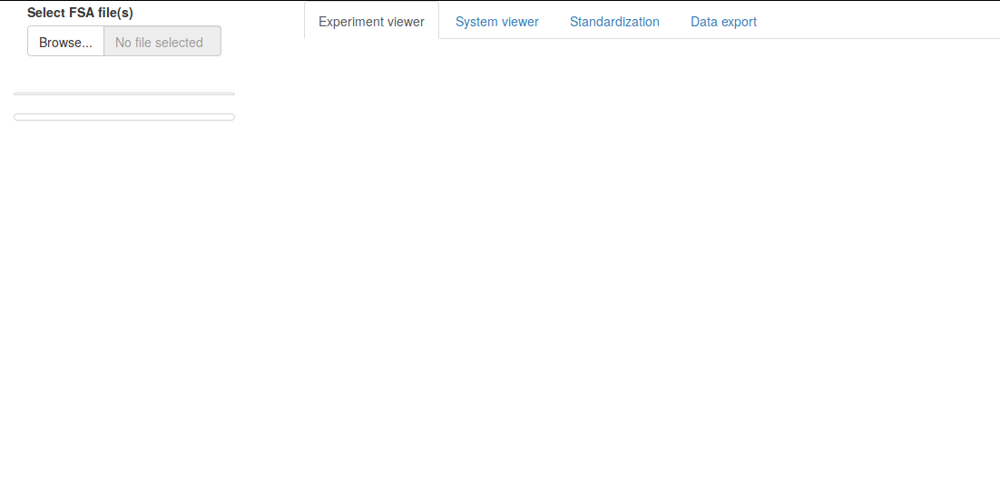{width=500px}

## Loading, visualizing and formatting the samples

To load the samples, click on the "Browse..." button in section "Select FSA file(s)". 
There are demonstration files within the directory ```system.file( "data","xfra",package = 'pickpeak')```. These files were generated using a XXX with the Amplidex FMR1 kit ([Asuragen Genetics](https://asuragen.com/)) for diagnostics of the X-fragile syndrom. 

Once the samples are loaded, the screen should look like Figure \@ref(fig:demosamplesmev).

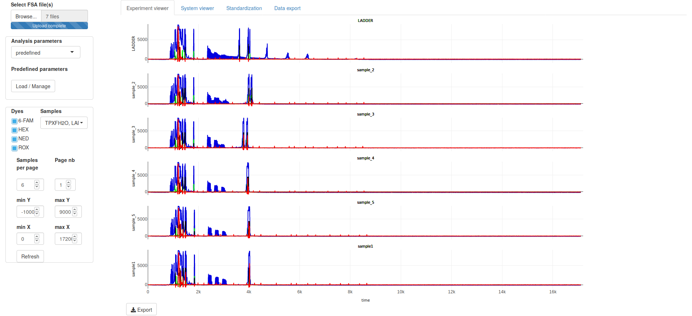{width=500px}

In the left pannel, there are two main windows : 

* Above, the analysis parameters which allow the users to specify the way the data should be processed
* Below, the visualization parameters which allow the users to modify the main window view.

Note that, as all figures in pickpeak are drawn using the [plotly library](https://plot.ly/) library. All the features that are generally associated with it are also made available to plotly (zoom, pan, figure export, etc). Those features are available by using the small icons on top of each plotly figure (Figure \@ref(fig:visualizationparametersmev)).

Beware, to visualize any of the changes brought to the visualization window, the user must not forget to click on the refresh button.

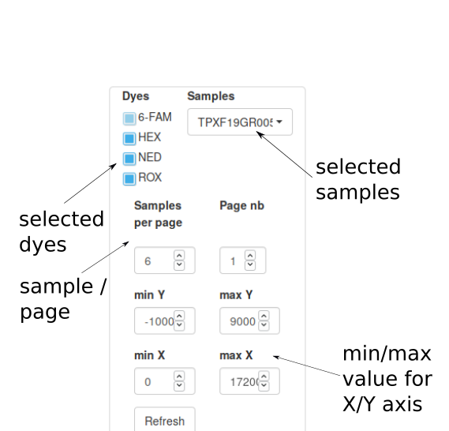{width=250px}

## Scaling the migration time of the samples and peaks annotation

Pickpeak is able to convert raw capillary electrophoresis measurements into re-scaled data. Scaling of the data is the first main step as it consists in converting the migration times to fragment lengths according to a set of nucleotides of knownlenghts labelled with a specific dye  (Figure \@ref(fig:scaling1)).

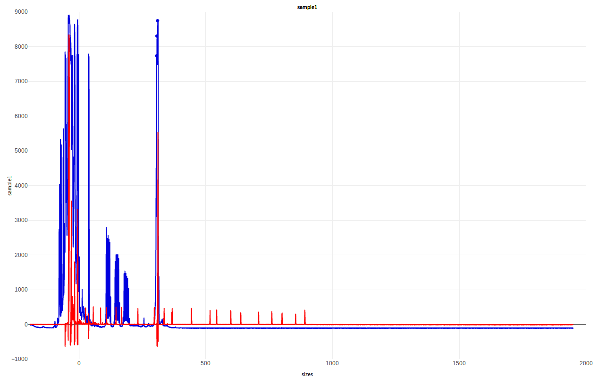{width=300px}

To scale the samples, the following steps must be followed.

* Select analysis parameters
* Select custom sample settings

In the new windows that pops up, for each sample select the minimum peak height. If the limit is too high or too low the number of detected peaks for the scaling fragments will not be correspond to the expected number of peaks and scaling will become impossible  (Figure \@ref(fig:peaksthresholds)).

In this menu, you can also specify whether a given sample should always be on the top of each plot page (always above checkbox). 

The clone value button allows users to specify the same value for all dyes and all samples (Clone value button).

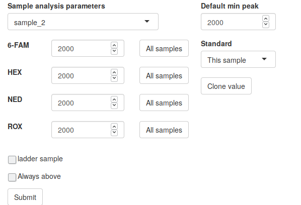{width=300px}

That being done, the user can now select the scale as well as the scaling dye. In our example, the scaling fragments are ROX1000 and the scaling dye is ROX. The viewer should then display the intensity values using the fragment lengths instead of the migration time (Figure \@ref(fig:scaling2)). 

Converting migration time into fragment lengths is achieved via a linear regression. To check whether the relation between lengths and time is linear, one can check the "Standardization" tab (Figure  \@ref(fig:scaling3)).

One can see on Figures \@ref(fig:scaling2) and  \@ref(fig:scaling3) that there is one sample for which the length/time correlation is not optimal (sample_1). Indeed, figure \@ref(fig:scaling2) shows that the red peaks (corresponding to the fragments on known sizes) of sample_1 are not well aligned with those of the other samples. Moreover, Figure \@ref(fig:scaling3) shows a different correlation pattern. This is due to the fact that sample_1 presents a parasitic peak with a somewhat large intensity (above our 100 intensity threhsold). As this peak is taken into acount to set up the linear regression model for the estimation of the fragment length, we must get rid of it, e.g., by increasing the threshold to 200 for peak detection for sample_1. Doing this, you can observe on Figure X that all correlation seem more similar .


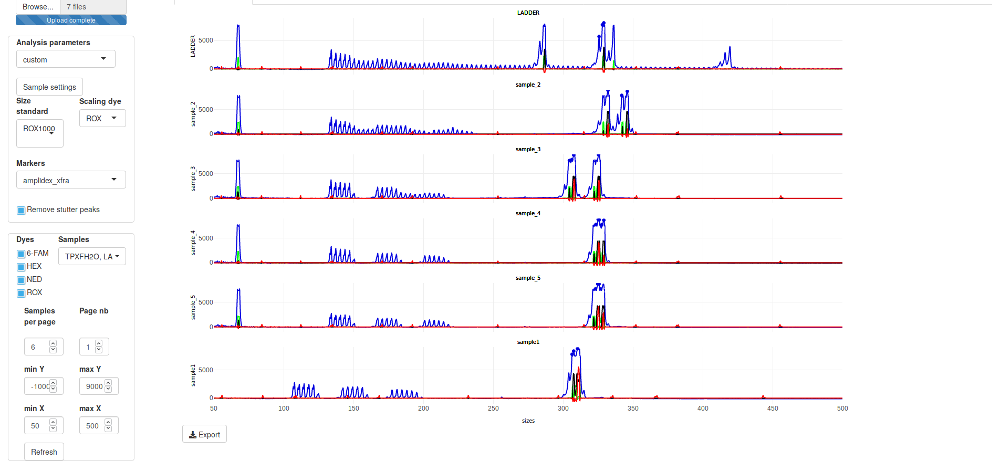{width=500px}

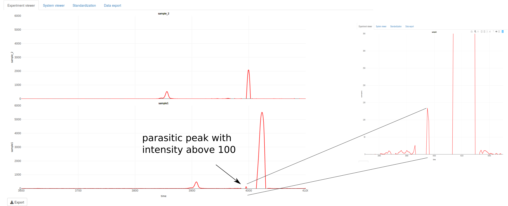{width=500px}

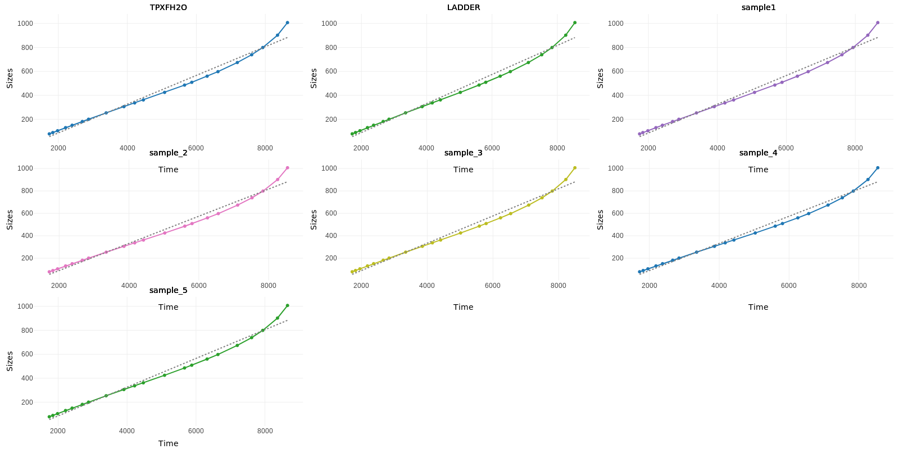{width=500px}

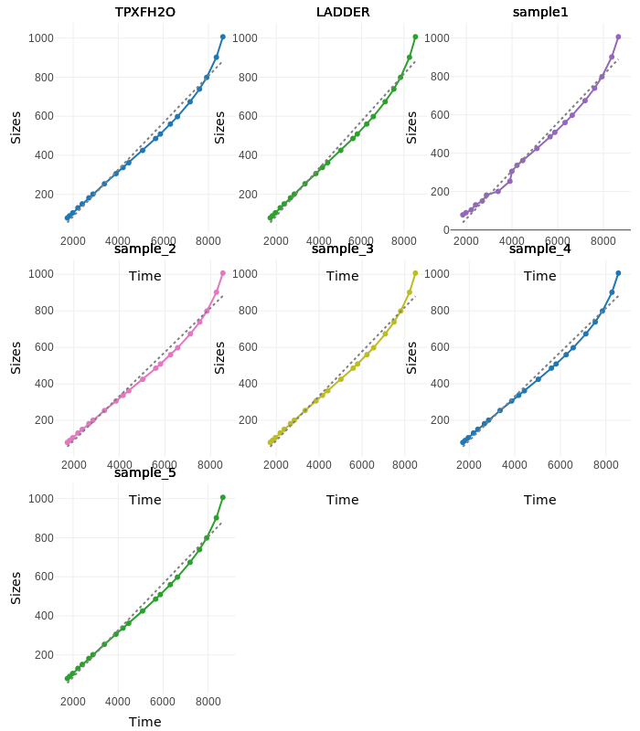{width=500px}

Optionally, now that the length have been estimated, the peaks of each sample can be categorized into different systems. The type of experiment analyzed can be selected via the left menu (markers). However, for this menu to contain analyses, the configuration files described above (markers.tab and the marker file) must be available.

Peaks for all samples are also inferred during this last step. When a peak is discovered, a big dot is displayed on top of it.

## Ladder samples

In some capillary electrophoresis experiments, one or more ladder sample(s) are included. These samples contain and have a (bin) name for all the fragments of interest can be compared to the experiment fragments to infer their names. Ladder samples must be specified in the menu where custom analysis parameters were defined. A bin file must be specified in the markers.tab file (see above). As for the scaling fragments, the number of peaks must correspond to the number bins that are specified in the bin file.

## Predefined parameters

To save time, pickpeak allows to specify a set of parameters that should work for a given type of experiment. To this, the file predef.tab must be present,  the user must select Analysis parameters "predefined" and Predefined parameters "Load / Manage". If the experiment is already predefined, one must just select it and click on Submit button (Figure \@ref(fig:predef)).

If the experiment is not specified, one must define it by clicking on Edit/Create. This opens a windows where you can specify :

* the name of the experiment type
* the minimum threshold value for peak detection for every dye.
* standard dye and standard scale
* the list of systems for a given experiment

You must then click on save after the data have been entered.

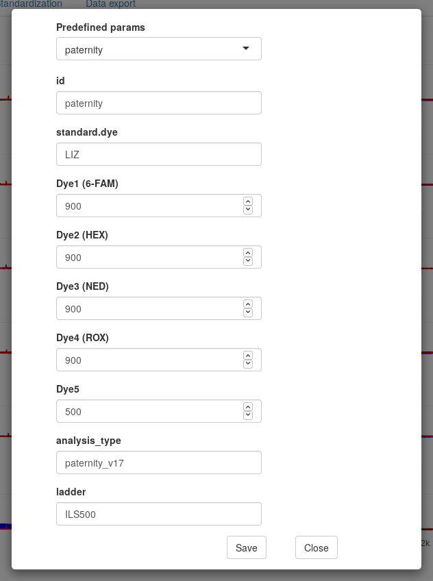{width=250px}

## Single experiment viewer

### Introduction

The single experiment viewer tab allows to focus on individual systems or peaks that have been detected (manually or automatically). It can remove non relevant peaks as well or add peaks that were missed in the previous peak detection steps. Beware, the single experiment viewer is only working if the raw data were scaled and if the detected peaks were matched with systems in the previous steps.

The examples that will be depected on the following figures were not obtained using the example dataset as it does only contains one system and is less illustrative. Here, we make use of data generated using the PowerPlex ESX 17 kit for paternity testing developed by [Promega](http://www.promega.com).

### Single experiment viewer description.
The Figure \@ref(fig:sevintro) shows the main screen of the single experiment viewer. The left part of the screen can be used to modify the view on the right side of the screen. Notably, one can select the system or the dyes that should be on the right side. The table in the middle contains the list of peaks that are to be seen on the right part. A click on one row in this table highlights the corresponds peaks in the view on the right (Figure \@ref(fig:peakselection)). A peak can also be selected by clicking on the dot on top of it. Information about the peak will then be available in a table on the left of the screen.

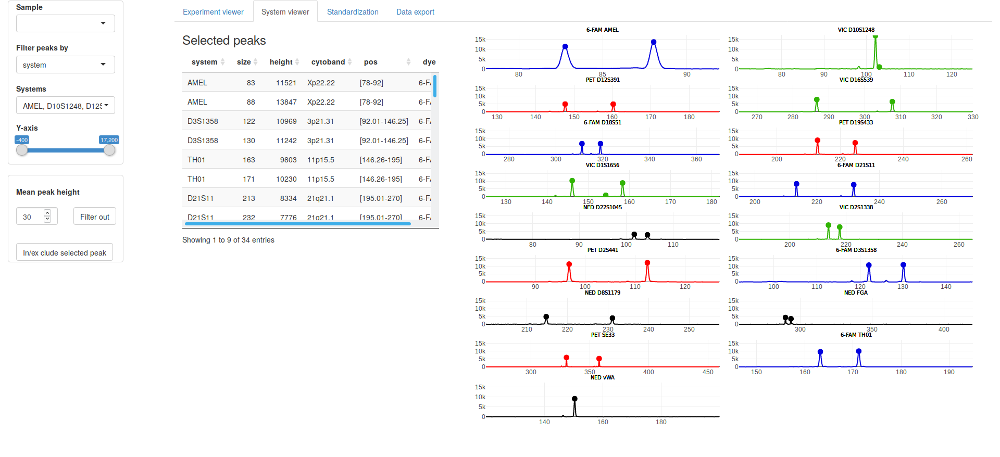{width=500px}


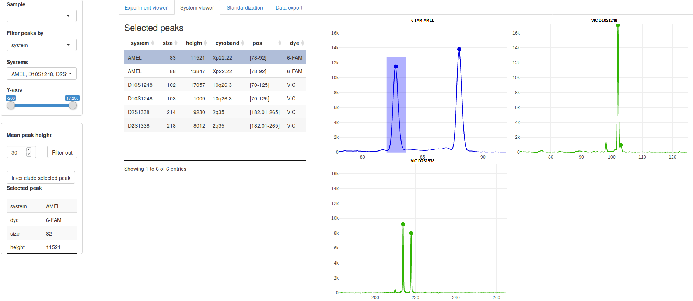{width=500px}

### Peak exclusion
There are two ways to remove a peak that has been detected. You can either select it by clicking on it or by clicking on its corresponding raw in the middle table. 
When selected, you can remove it by clicking on In/Ex-clude peak (it is then moved to a second table below which is called excluded peaks). You can also reintegrate it in the list of selected peaks by selecting it in the table and click again on In/Ex-clude peak (Figure  \@ref(fig:peakremoval)).

In case the detection method has been too sensitive, you can also exclude all the peaks below a given intensity value. To this, simply indicate the threhsold value (in the min peak height field on the left) and click on filter out.

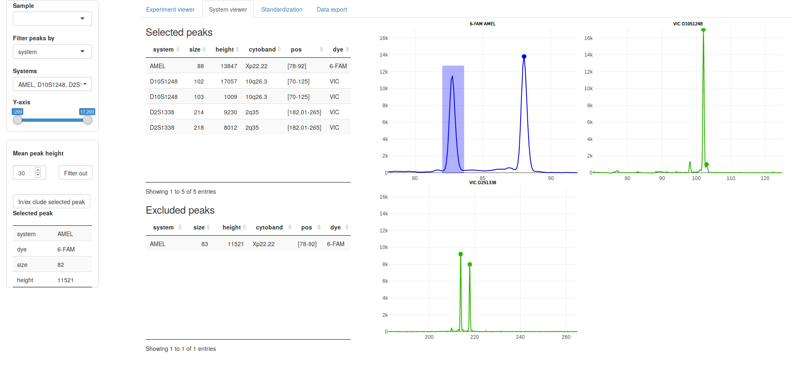{width=500px}

### Peak addition

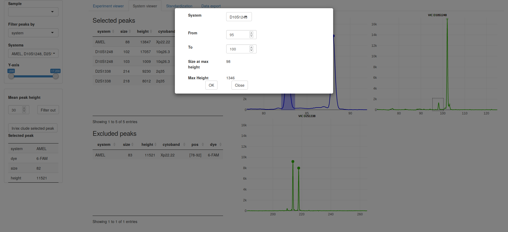{width=500px}

If a peak has not been automatically detected, one can still add it to the list of selected peak. To this, select the small plotly icon "box select" on top of the figure with the peaks. Draw a box around the peak that you want to add. A window will open where you will have the possibility to precise the coordinates and the intensity of the peak as well as the system to which it belongs (Figure  \@ref(fig:peakaddition)).

## Data export

Data can be exported to be analyzed with other tools (tab Data Export). The export can be done for all samples together or for a subset of samples. Several formats such as tab-delimted or Excel are available. There are four types of output.

* Raw data : Table of data with intensities for each dye for each time migration value
* Standardized data : Table of data with intensities for each dye at each migration time point which are converted to fragment lengths.
* Peaks : List of all detected peaks. If it corresponds to a given system, it is indicated. 
* Systems : List of all peaks detected within a system (one system per line) (Figure  \@ref(fig:export)).

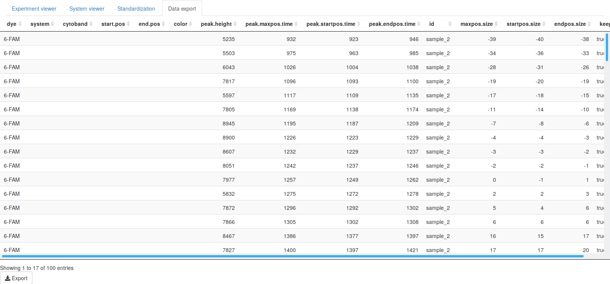{width=500px}

# Misceallanous

## Create a direct link on the Desktop (windows user only)


